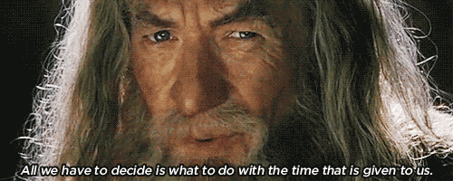

<!--
**hlaack/hlaack** is a ✨ _special_ ✨ repository because its `README.md` (this file) appears on your GitHub profile.

Here are some ideas to get you started:

- 🔭 I’m currently working on ...
- 🌱 I’m currently learning ...
- 👯 I’m looking to collaborate on ...
- 🤔 I’m looking for help with ...
- 💬 Ask me about ...
- 📫 How to reach me: ...
- 😄 Pronouns: ...
- ⚡ Fun fact: ...
-->

## :wave: Greetings all!
---
## Some factoids about me:
## :microphone: I'm a represented voice over artist! I audition nearly every day.
## :dragon_face: I love telling stories through Tabletop Role-playing Games.
## :zap: I'm currently challenging myself to learn VIM motions (through a VSCode NeoVIM fork extension)!
## :hurtrealbad: One of my long term coding goals is to create (and understand) a raycast game engine.